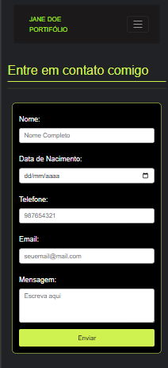
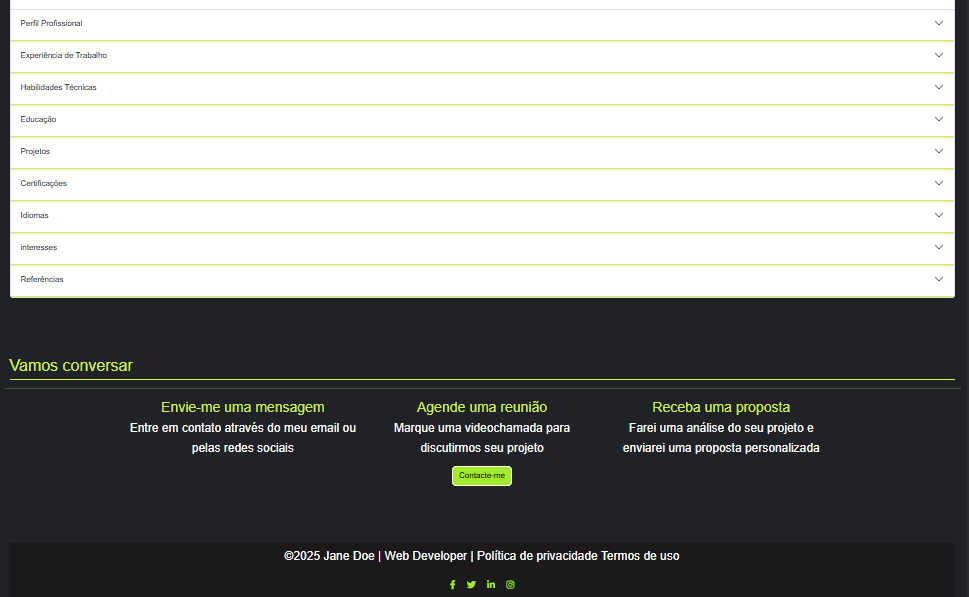

# Portfólio Jane Doe

Portfólio pessoal de uma desenvolvedora web, desenvolvido em PHP e preparado para execução local através do XAMPP.

## Screenshots

### Página Inicial


### Página Inicial Móvel


### Contacto Mobile



### Experiência


### Sobre Mim



## Funcionalidades

- Página inicial com apresentação, competências, experiência e serviços.
- Página “Sobre Mim” com informações profissionais.
- Galeria de projetos com visualização ampliada através do GLightbox.
- Serviços carregados dinamicamente a partir de `servicos.json`.
- Formulário de contacto com validação no navegador.
- Mapa com Leaflet e cálculo de rota através do OpenStreetMap, Nominatim e OSRM.
- Simulador de orçamento para projetos web, mobile e UX/UI.
- FAQ interativo.
- Registo e login de utilizadores.
- Perfil de utilizador com controlo de sessão.
- Área administrativa com consulta de categorias, projetos e relatórios.

## Tecnologias

- PHP 8 
- MySQL/MariaDB
- HTML5 e CSS3
- JavaScript
- Bootstrap 5
- jQuery
- Font Awesome
- Leaflet e Leaflet Routing Machine

## Requisitos

- Windows com XAMPP instalado.
- Apache ativo no XAMPP.
- MySQL ativo no XAMPP.
- PHP com a extensão `mysqli` ativada.
- Ligação à internet para carregar bibliotecas CDN, mapas e rotas.
a
## Estrutura principal

```text
janeDoe/
├── admin.php              # Área administrativa
├── contacto.php           # Contacto, mapa, orçamento e FAQ
├── db.php                 # Ligações MySQL
├── index.php              # Página inicial
├── login.php              # Formulário de login
├── logout.php             # Termina a sessão
├── process_login.php      # Processa o login
├── process_register.php   # Processa o registo
├── profile.php            # Perfil do utilizador
├── projetos.php           # Galeria de projetos
├── register.php           # Formulário de registo
├── servicos.php           # Lista interativa de serviços
├── sobre.php              # Informação profissional
├── projects.json          # Dados de projetos
├── servicos.json          # Dados de serviços
├── css/style.css          # Estilos globais
├── js/javascript.js       # Validações e FAQ
├── image/                 # Imagens do portfólio
├── includes/              # Cabeçalho e rodapé comuns
└── uploads/               # Ficheiros enviados pelos utilizadores
```

## Fluxo de autenticação

1. O utilizador preenche o formulário em `register.php`.
2. `process_register.php` valida os dados e guarda a palavra-passe com `password_hash()`.
3. `process_login.php` valida a palavra-passe com `password_verify()`.
4. Os dados do utilizador são guardados na sessão.
5. `profile.php` restringe o acesso a utilizadores autenticados.

## Licença

Não foi definida uma licença para este projeto.
